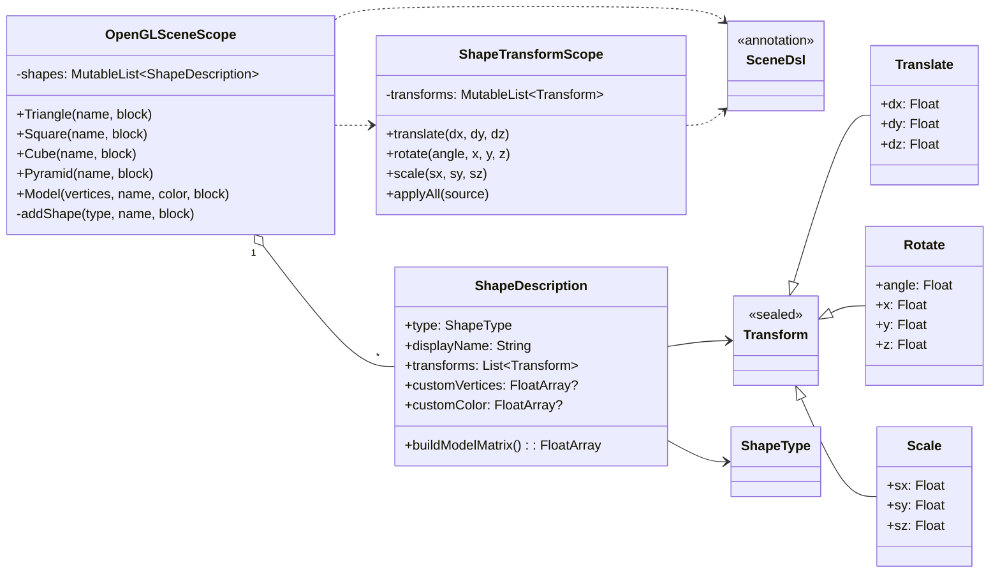

# UML: DSL Layer

```mermaid
classDiagram
direction LR

class SceneDsl {
  <<annotation>>
}

class OpenGLSceneScope {
  -shapes: MutableList~ShapeDescription~
  +Triangle(name, block)
  +Square(name, block)
  +Cube(name, block)
  +Pyramid(name, block)
  +Model(vertices, name, color, block)
  -addShape(type, name, block)
}

class ShapeTransformScope {
  -transforms: MutableList~Transform~
  +translate(dx, dy, dz)
  +rotate(angle, x, y, z)
  +scale(sx, sy, sz)
  +applyAll(source)
}

class ShapeDescription {
  +type: ShapeType
  +displayName: String
  +transforms: List~Transform~
  +customVertices: FloatArray?
  +customColor: FloatArray?
  +buildModelMatrix(): FloatArray
}

class Transform {
  <<sealed>>
}
class Translate {
  +dx: Float
  +dy: Float
  +dz: Float
}
class Rotate {
  +angle: Float
  +x: Float
  +y: Float
  +z: Float
}
class Scale {
  +sx: Float
  +sy: Float
  +sz: Float
}

Transform <|-- Translate
Transform <|-- Rotate
Transform <|-- Scale

OpenGLSceneScope "1" o-- "*" ShapeDescription
OpenGLSceneScope ..> ShapeTransformScope
ShapeDescription --> ShapeType
ShapeDescription --> Transform
OpenGLSceneScope ..> SceneDsl
ShapeTransformScope ..> SceneDsl
```
