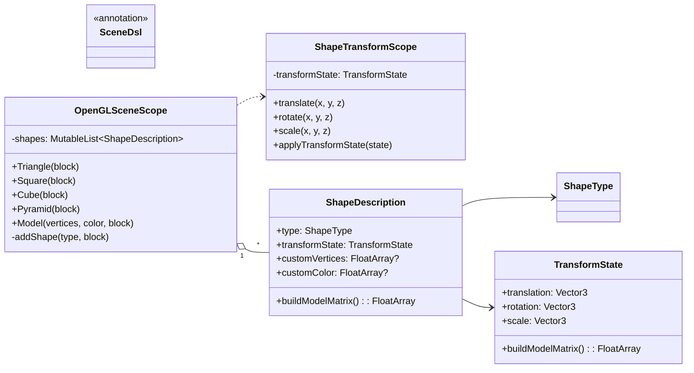

# UML: DSL Layer

```mermaid
classDiagram
direction LR

class SceneDsl {
  <<annotation>>
}

class OpenGLSceneScope {
  -shapes: MutableList~ShapeDescription~
  +Triangle(block)
  +Square(block)
  +Cube(block)
  +Pyramid(block)
  +Model(vertices, color, block)
  -addShape(type, block)
}

class ShapeTransformScope {
  -transformState: TransformState
  +translate(x, y, z)
  +rotate(x, y, z)
  +scale(x, y, z)
  +applyTransformState(state)
}

class ShapeDescription {
  +type: ShapeType
  +transformState: TransformState
  +customVertices: FloatArray?
  +customColor: FloatArray?
  +buildModelMatrix(): FloatArray
}

class TransformState {
  +translation: Vector3
  +rotation: Vector3
  +scale: Vector3
  +buildModelMatrix(): FloatArray
}

OpenGLSceneScope "1" o-- "*" ShapeDescription
OpenGLSceneScope ..> ShapeTransformScope
ShapeDescription --> ShapeType
ShapeDescription --> TransformState
```
