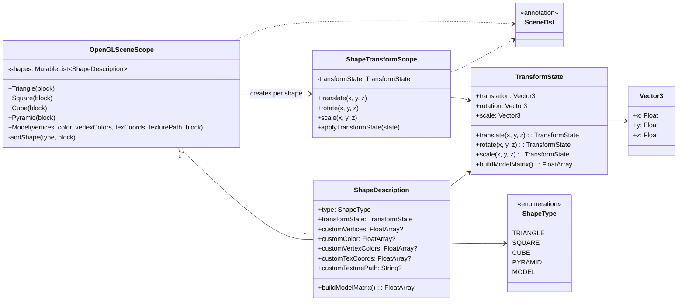

# UML: DSL Layer

```mermaid
classDiagram
direction LR

class SceneDsl {
  <<annotation>>
}

class OpenGLSceneScope {
  -shapes: MutableList~ShapeDescription~
  +Triangle(block)
  +Square(block)
  +Cube(block)
  +Pyramid(block)
  +Model(vertices, color, vertexColors, texCoords, texturePath, block)
  -addShape(type, block)
}

class ShapeTransformScope {
  -transformState: TransformState
  +translate(x, y, z)
  +rotate(x, y, z)
  +scale(x, y, z)
  +applyTransformState(state)
}

class ShapeDescription {
  +type: ShapeType
  +transformState: TransformState
  +customVertices: FloatArray?
  +customColor: FloatArray?
  +customVertexColors: FloatArray?
  +customTexCoords: FloatArray?
  +customTexturePath: String?
  +buildModelMatrix(): FloatArray
}

class TransformState {
  +translation: Vector3
  +rotation: Vector3
  +scale: Vector3
  +translate(x, y, z): TransformState
  +rotate(x, y, z): TransformState
  +scale(x, y, z): TransformState
  +buildModelMatrix(): FloatArray
}

class Vector3 {
  +x: Float
  +y: Float
  +z: Float
}

class ShapeType {
  <<enumeration>>
  TRIANGLE
  SQUARE
  CUBE
  PYRAMID
  MODEL
}

OpenGLSceneScope "1" o-- "*" ShapeDescription
OpenGLSceneScope ..> ShapeTransformScope : creates per shape
ShapeTransformScope --> TransformState
ShapeDescription --> TransformState
ShapeDescription --> ShapeType
TransformState --> Vector3
OpenGLSceneScope ..> SceneDsl
ShapeTransformScope ..> SceneDsl
```
