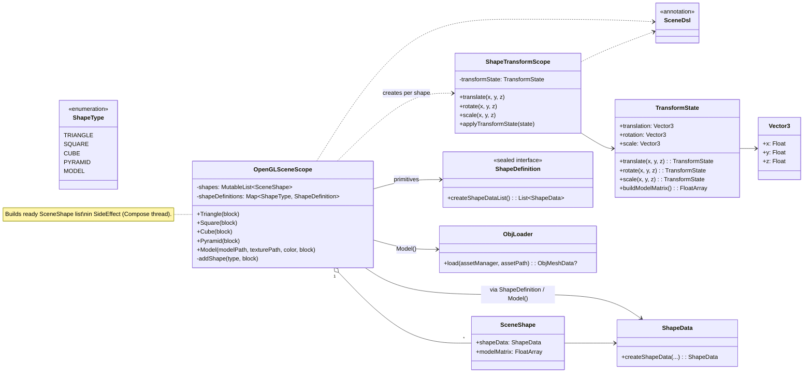

# UML: DSL Layer

```mermaid
classDiagram
direction LR

class SceneDsl {
  <<annotation>>
}

class OpenGLSceneScope {
  -shapes: MutableList~SceneShape~
  -shapeDefinitions: Map~ShapeType, ShapeDefinition~
  +Triangle(block)
  +Square(block)
  +Cube(block)
  +Pyramid(block)
  +Model(modelPath, texturePath, color, block)
  -addShape(type, block)
}

class ShapeTransformScope {
  -transformState: TransformState
  +translate(x, y, z)
  +rotate(x, y, z)
  +scale(x, y, z)
  +applyTransformState(state)
}

class SceneShape {
  +shapeData: ShapeData
  +modelMatrix: FloatArray
}

class TransformState {
  +translation: Vector3
  +rotation: Vector3
  +scale: Vector3
  +translate(x, y, z): TransformState
  +rotate(x, y, z): TransformState
  +scale(x, y, z): TransformState
  +buildModelMatrix(): FloatArray
}

class Vector3 {
  +x: Float
  +y: Float
  +z: Float
}

class ShapeType {
  <<enumeration>>
  TRIANGLE
  SQUARE
  CUBE
  PYRAMID
  MODEL
}

class ShapeDefinition {
  <<sealed interface>>
  +createShapeDataList(): List~ShapeData~
}

class ShapeData {
  +createShapeData(...): ShapeData
}

class ObjLoader {
  +load(assetManager, assetPath): ObjMeshData?
}

OpenGLSceneScope "1" o-- "*" SceneShape
OpenGLSceneScope ..> ShapeTransformScope : creates per shape
OpenGLSceneScope --> ShapeDefinition : primitives
OpenGLSceneScope --> ShapeData : via ShapeDefinition / Model()
OpenGLSceneScope --> ObjLoader : Model()
SceneShape --> ShapeData
ShapeTransformScope --> TransformState
TransformState --> Vector3
OpenGLSceneScope ..> SceneDsl
ShapeTransformScope ..> SceneDsl

note for OpenGLSceneScope "Builds ready SceneShape list\nin SideEffect (Compose thread)."
```
