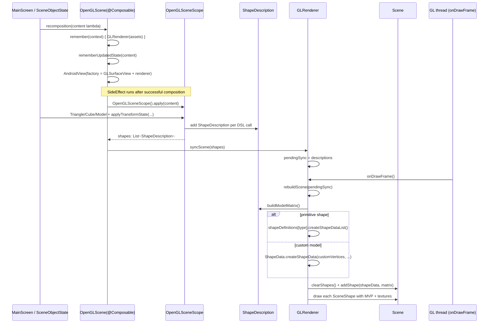

# UML: Compose to GL Sync

```mermaid
sequenceDiagram
participant UI as MainScreen / SceneObjectState
participant OGS as OpenGLScene(@Composable)
participant Scope as OpenGLSceneScope
participant Desc as ShapeDescription
participant Renderer as GLRenderer
participant Scene as Scene
participant GL as GL thread (onDrawFrame)

UI->>OGS: recomposition(content lambda)
OGS->>OGS: remember(context) { GLRenderer(assets) }
OGS->>OGS: rememberUpdatedState(content)
OGS->>OGS: AndroidView(factory = GLSurfaceView + renderer)

Note over OGS,Scope: SideEffect runs after successful composition
OGS->>Scope: OpenGLSceneScope().apply(content)
UI->>Scope: Triangle/Cube/Model + applyTransformState(...)
Scope->>Desc: add ShapeDescription per DSL call
Scope-->>OGS: shapes: List~ShapeDescription~
OGS->>Renderer: syncScene(shapes)
Renderer->>Renderer: pendingSync = descriptions

GL->>Renderer: onDrawFrame()
Renderer->>Renderer: rebuildScene(pendingSync)
Renderer->>Desc: buildModelMatrix()
alt primitive shape
  Renderer->>Renderer: shapeDefinitions[type].createShapeDataList()
else custom model
  Renderer->>Renderer: ShapeData.createShapeData(customVertices, ...)
end
Renderer->>Scene: clearShapes() + addShape(shapeData, matrix)
Renderer->>Scene: draw each SceneShape with MVP + textures
```
