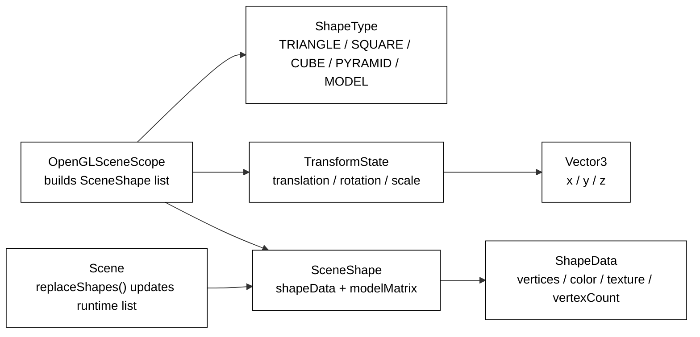

# UML: Scene and Domain Geometry Layer

```mermaid
flowchart LR
    Scope["OpenGLSceneScope<br/>builds SceneShape list"]
    ShapeType["ShapeType<br/>TRIANGLE / SQUARE / CUBE / PYRAMID / MODEL"]
    Transform["TransformState<br/>translation / rotation / scale"]
    Vector["Vector3<br/>x / y / z"]
    SceneShape["SceneShape<br/>shapeData + modelMatrix"]
    ShapeData["ShapeData<br/>vertices / color / texture / vertexCount"]
    Scene["Scene<br/>replaceShapes() updates runtime list"]

    Scope --> ShapeType
    Scope --> Transform
    Transform --> Vector
    Scope --> SceneShape
    SceneShape --> ShapeData
    Scene --> SceneShape

    style Scope fill:#ffffff,stroke:#000000,color:#000000
    style ShapeType fill:#ffffff,stroke:#000000,color:#000000
    style Transform fill:#ffffff,stroke:#000000,color:#000000
    style Vector fill:#ffffff,stroke:#000000,color:#000000
    style SceneShape fill:#ffffff,stroke:#000000,color:#000000
    style ShapeData fill:#ffffff,stroke:#000000,color:#000000
    style Scene fill:#ffffff,stroke:#000000,color:#000000
```
