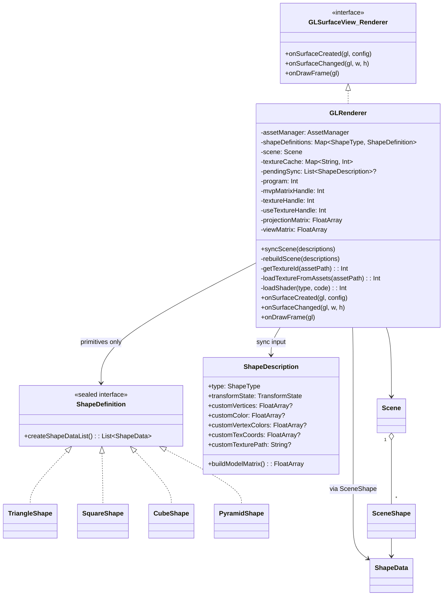

# UML: OpenGL Render Layer

```mermaid
classDiagram
direction TB

class GLSurfaceView_Renderer {
  <<interface>>
  +onSurfaceCreated(gl, config)
  +onSurfaceChanged(gl, w, h)
  +onDrawFrame(gl)
}

class GLRenderer {
  -assetManager: AssetManager
  -shapeDefinitions: Map~ShapeType, ShapeDefinition~
  -scene: Scene
  -textureCache: Map~String, Int~
  -pendingSync: List~ShapeDescription~?
  -program: Int
  -mvpMatrixHandle: Int
  -textureHandle: Int
  -useTextureHandle: Int
  -projectionMatrix: FloatArray
  -viewMatrix: FloatArray
  +syncScene(descriptions)
  -rebuildScene(descriptions)
  -getTextureId(assetPath): Int
  -loadTextureFromAssets(assetPath): Int
  -loadShader(type, code): Int
  +onSurfaceCreated(gl, config)
  +onSurfaceChanged(gl, w, h)
  +onDrawFrame(gl)
}

class ShapeDefinition {
  <<sealed interface>>
  +createShapeDataList(): List~ShapeData~
}

class TriangleShape
class SquareShape
class CubeShape
class PyramidShape

class ShapeDescription {
  +type: ShapeType
  +transformState: TransformState
  +customVertices: FloatArray?
  +customColor: FloatArray?
  +customVertexColors: FloatArray?
  +customTexCoords: FloatArray?
  +customTexturePath: String?
  +buildModelMatrix(): FloatArray
}

class Scene
class SceneShape
class ShapeData

GLSurfaceView_Renderer <|.. GLRenderer
GLRenderer --> Scene
GLRenderer --> ShapeDescription : sync input
GLRenderer --> ShapeDefinition : primitives only
GLRenderer --> ShapeData : via SceneShape
ShapeDefinition <|.. TriangleShape
ShapeDefinition <|.. SquareShape
ShapeDefinition <|.. CubeShape
ShapeDefinition <|.. PyramidShape
Scene "1" o-- "*" SceneShape
SceneShape --> ShapeData
```
