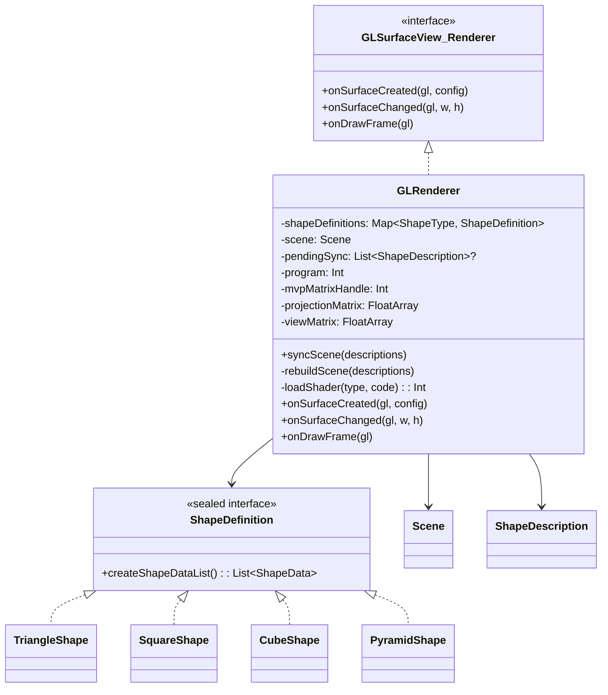

# UML: OpenGL Render Layer

```mermaid
classDiagram
direction TB

class GLSurfaceView_Renderer {
  <<interface>>
  +onSurfaceCreated(gl, config)
  +onSurfaceChanged(gl, w, h)
  +onDrawFrame(gl)
}

class GLRenderer {
  -shapeDefinitions: Map~ShapeType, ShapeDefinition~
  -scene: Scene
  -pendingSync: List~ShapeDescription~?
  -program: Int
  -mvpMatrixHandle: Int
  -projectionMatrix: FloatArray
  -viewMatrix: FloatArray
  +syncScene(descriptions)
  -rebuildScene(descriptions)
  -loadShader(type, code): Int
  +onSurfaceCreated(gl, config)
  +onSurfaceChanged(gl, w, h)
  +onDrawFrame(gl)
}

class ShapeDefinition {
  <<sealed interface>>
  +createShapeDataList(): List~ShapeData~
}
class TriangleShape
class SquareShape
class CubeShape
class PyramidShape

GLSurfaceView_Renderer <|.. GLRenderer
GLRenderer --> Scene
GLRenderer --> ShapeDescription
GLRenderer --> ShapeDefinition
ShapeDefinition <|.. TriangleShape
ShapeDefinition <|.. SquareShape
ShapeDefinition <|.. CubeShape
ShapeDefinition <|.. PyramidShape
```
