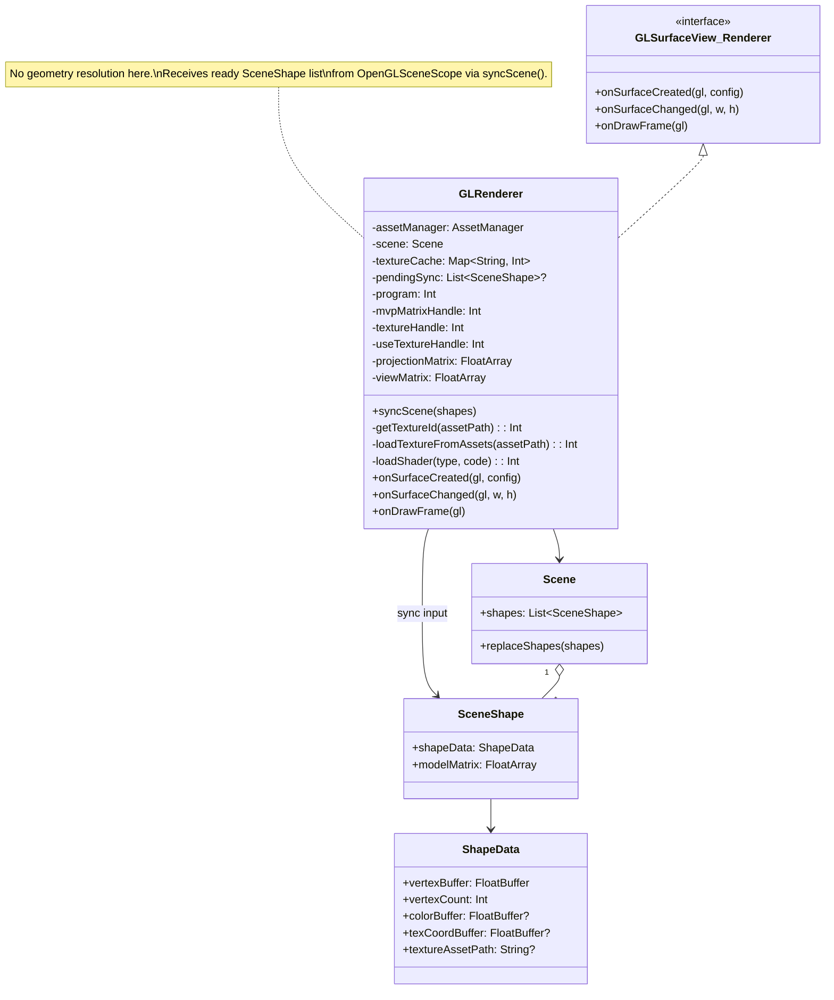

# UML: OpenGL Render Layer

```mermaid
classDiagram
direction TB

class GLSurfaceView_Renderer {
  <<interface>>
  +onSurfaceCreated(gl, config)
  +onSurfaceChanged(gl, w, h)
  +onDrawFrame(gl)
}

class GLRenderer {
  -assetManager: AssetManager
  -scene: Scene
  -textureCache: Map~String, Int~
  -pendingSync: List~SceneShape~?
  -program: Int
  -mvpMatrixHandle: Int
  -textureHandle: Int
  -useTextureHandle: Int
  -projectionMatrix: FloatArray
  -viewMatrix: FloatArray
  +syncScene(shapes)
  -getTextureId(assetPath): Int
  -loadTextureFromAssets(assetPath): Int
  -loadShader(type, code): Int
  +onSurfaceCreated(gl, config)
  +onSurfaceChanged(gl, w, h)
  +onDrawFrame(gl)
}

class Scene {
  +replaceShapes(shapes)
  +shapes: List~SceneShape~
}

class SceneShape {
  +shapeData: ShapeData
  +modelMatrix: FloatArray
}

class ShapeData {
  +vertexBuffer: FloatBuffer
  +vertexCount: Int
  +colorBuffer: FloatBuffer?
  +texCoordBuffer: FloatBuffer?
  +textureAssetPath: String?
}

GLSurfaceView_Renderer <|.. GLRenderer
GLRenderer --> Scene
GLRenderer --> SceneShape : sync input
Scene "1" o-- "*" SceneShape
SceneShape --> ShapeData

note for GLRenderer "No geometry resolution here.\nReceives ready SceneShape list\nfrom OpenGLSceneScope via syncScene()."
```
