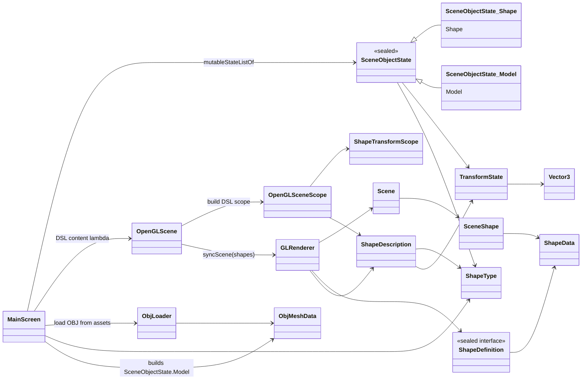

# UML: Overall Architecture

```mermaid
classDiagram
direction LR

class MainScreen
class SceneObjectState {
  <<sealed>>
}
class SceneObjectState_Shape {
  Shape
}
class SceneObjectState_Model {
  Model
}
class OpenGLScene
class OpenGLSceneScope
class ShapeTransformScope
class ShapeDescription
class TransformState
class Vector3
class GLRenderer
class Scene
class SceneShape
class ShapeDefinition {
  <<sealed interface>>
}
class ShapeData
class ObjLoader
class ObjMeshData
class ShapeType

SceneObjectState <|-- SceneObjectState_Shape
SceneObjectState <|-- SceneObjectState_Model

MainScreen --> SceneObjectState : mutableStateListOf
MainScreen --> OpenGLScene : DSL content lambda
MainScreen --> ObjLoader : load OBJ from assets
MainScreen --> ShapeType

SceneObjectState --> TransformState
SceneObjectState --> ShapeType

OpenGLScene --> OpenGLSceneScope : build DSL scope
OpenGLScene --> GLRenderer : syncScene(shapes)

OpenGLSceneScope --> ShapeTransformScope
OpenGLSceneScope --> ShapeDescription
ShapeDescription --> ShapeType
ShapeDescription --> TransformState
TransformState --> Vector3

GLRenderer --> Scene
GLRenderer --> ShapeDefinition
GLRenderer --> ShapeDescription
Scene --> SceneShape
SceneShape --> ShapeData
ShapeDefinition --> ShapeData

ObjLoader --> ObjMeshData
MainScreen --> ObjMeshData : builds SceneObjectState.Model
```
