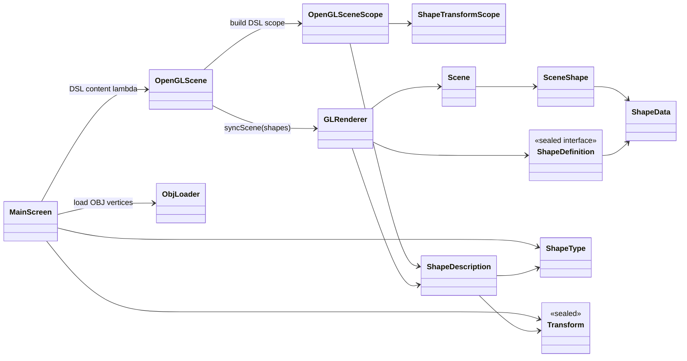

# UML: Overall Architecture

```mermaid
classDiagram
direction LR

class MainScreen
class OpenGLScene
class OpenGLSceneScope
class ShapeTransformScope
class ShapeDescription
class GLRenderer
class Scene
class SceneShape
class ShapeDefinition {
  <<sealed interface>>
}
class ShapeData
class ObjLoader
class ShapeType
class Transform {
  <<sealed>>
}

MainScreen --> OpenGLScene : DSL content lambda
MainScreen --> ObjLoader : load OBJ vertices
MainScreen --> ShapeType
MainScreen --> Transform

OpenGLScene --> OpenGLSceneScope : build DSL scope
OpenGLScene --> GLRenderer : syncScene(shapes)

OpenGLSceneScope --> ShapeTransformScope
OpenGLSceneScope --> ShapeDescription
ShapeDescription --> ShapeType
ShapeDescription --> Transform

GLRenderer --> Scene
GLRenderer --> ShapeDefinition
GLRenderer --> ShapeDescription
Scene --> SceneShape
SceneShape --> ShapeData
ShapeDefinition --> ShapeData
```
