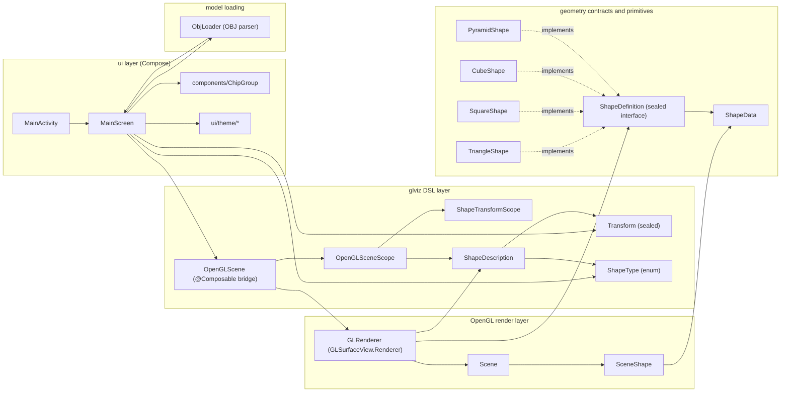

# UML: Package Components

```mermaid
flowchart LR
  subgraph UI["ui layer (Compose)"]
    MainActivity["MainActivity"]
    MainScreen["MainScreen"]
    ChipGroup["components/ChipGroup"]
    Theme["ui/theme/*"]
  end

  subgraph DSL["glviz DSL layer"]
    OpenGLScene["OpenGLScene (@Composable bridge)"]
    OpenGLSceneScope["OpenGLSceneScope"]
    ShapeTransformScope["ShapeTransformScope"]
    ShapeDescription["ShapeDescription"]
    Transform["Transform (sealed)"]
    ShapeType["ShapeType (enum)"]
  end

  subgraph Render["OpenGL render layer"]
    GLRenderer["GLRenderer (GLSurfaceView.Renderer)"]
    Scene["Scene"]
    SceneShape["SceneShape"]
  end

  subgraph Geometry["geometry contracts and primitives"]
    ShapeDefinition["ShapeDefinition (sealed interface)"]
    ShapeData["ShapeData"]
    Triangle["TriangleShape"]
    Square["SquareShape"]
    Cube["CubeShape"]
    Pyramid["PyramidShape"]
  end

  subgraph Models["model loading"]
    ObjLoader["ObjLoader (OBJ parser)"]
  end

  MainActivity --> MainScreen
  MainScreen --> ChipGroup
  MainScreen --> Theme

  MainScreen --> OpenGLScene
  MainScreen --> ObjLoader
  MainScreen --> ShapeType
  MainScreen --> Transform

  OpenGLScene --> OpenGLSceneScope
  OpenGLScene --> GLRenderer
  OpenGLSceneScope --> ShapeTransformScope
  OpenGLSceneScope --> ShapeDescription
  ShapeDescription --> Transform
  ShapeDescription --> ShapeType

  GLRenderer --> Scene
  Scene --> SceneShape
  SceneShape --> ShapeData

  GLRenderer --> ShapeDefinition
  GLRenderer --> ShapeDescription

  ShapeDefinition --> ShapeData
  Triangle -.implements.-> ShapeDefinition
  Square -.implements.-> ShapeDefinition
  Cube -.implements.-> ShapeDefinition
  Pyramid -.implements.-> ShapeDefinition

  ObjLoader --> MainScreen
```
